# The App Brewery Flutter Course Projects
In this repository, you can see what I have done and learned through this course.

## Course Syllabus

Take a look course syllabus:
- [Syllabus](App%20Brewery%20Flutter%20Course%20Syllabus.pdf)

## Projects

1- [I Am Poor](i_am_poor)

An app that simply displays an image at the center of the screen. The project has been written solely in Dart Language.

Through this project, I've learned how to:
-	set up a new Flutter project using Android Studio.
-	use  pre-made Flutter Widgets for user interface design.
-	incorporate Image and Text Widgets to create simple user interfaces.
-	incorporate App Icons for iOS and Android.
-	add and load image assets to Flutter projects.
-	run Flutter apps on iOS Simulator, Android Emulator, and physical devices.

Screenshot of the app:

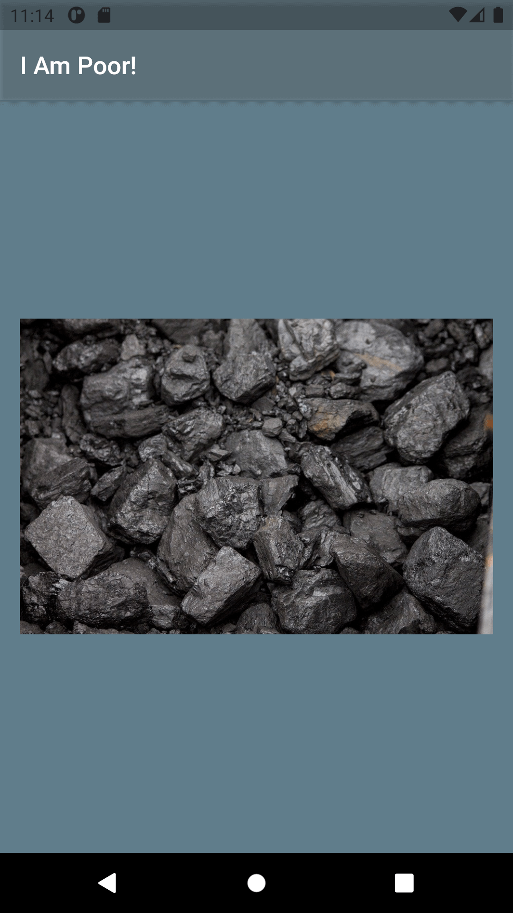

---

2- [Mi Card](mi_card)

A personal business card as an app. The project has been written solely in Dart Language.

Through this project, I've learned:
-	how to create Stateless Widgets.
-	what is the difference between hot reload and hot refresh and running an app from cold.
-	how to use Containers to lay out your UI.
-	how to use Columns and Rows to position your UI elements.
-	how to add custom fonts.
-	how to add Material icons.
-	how to style Text widgets.
-	how to read and use Flutter Documentation.

Screenshot of the app:

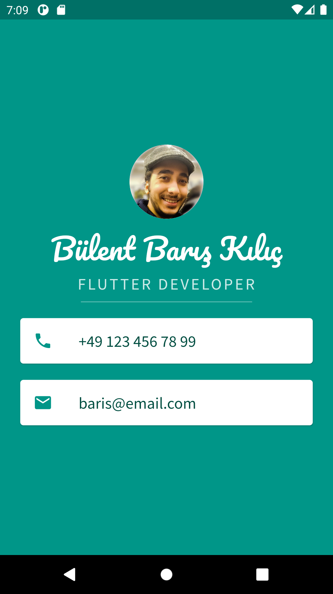

---

3- [Dicee](dicee)

A dice app that can make the die roll at the press of a button. The project has been written solely in Dart Language.

Through this project, I’ve learned:
-   how to use Flutter stateless widgets to design the user interface.
-	how to use Flutter stateful widgets to update the user interface.
-	how to change the properties of various widgets.
-	how to use onPressed listeners to detect when buttons are pressed.
-	how to use setState to mark the widget tree as dirty and requiring update on the next render.
-	how to use Expanded to make widgets adapt to screen dimensions.
-	string interpolation.
-	basic dart programming concepts such as data types and functions.
-	code and use gesture controls.

Screenshot of the app:

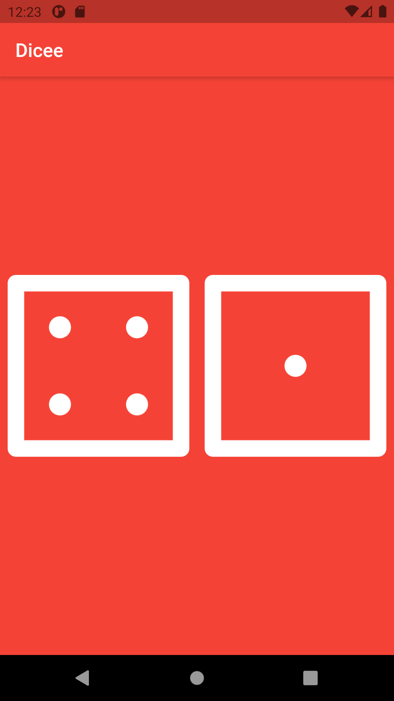

---

4- [Magic 8 Ball](magic_8_ball)

An app that will give you the answers to all the tricky questions in life. The project has been written solely in Dart Language.

The objective of this project is to solidify what I’ve learned in the Dicee project.

Screenshot of the app:

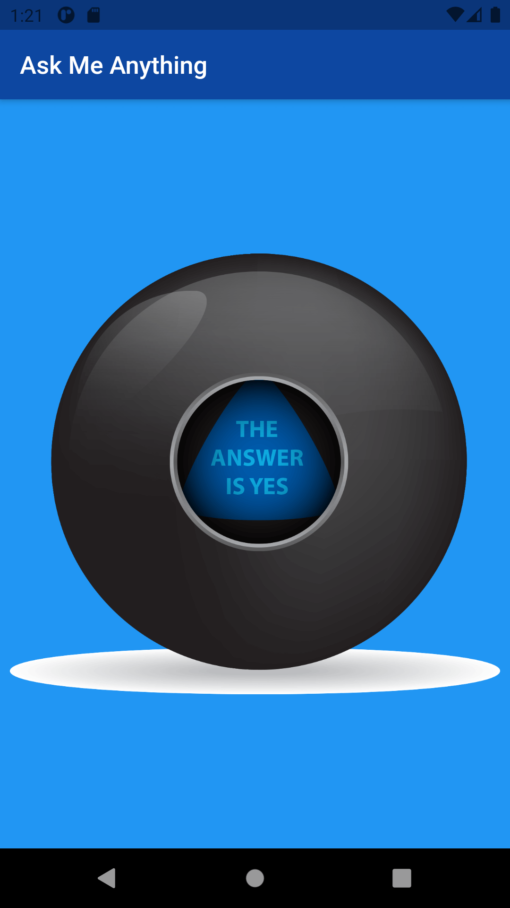

---

5- [Xylophone](xylophone)

An app that plays Xylophone sounds.

Through this project, I’ve learned:
-   how to incorporate open source libraries of code into your project using Flutter Packages.
-   how to play sound on both iOS and Android.
-   how to generate repeated user interface Widgets.
-   how to use Dart functions that can take input arguments as well as return an output.
-   dart arrow syntax for writing one line functions.

Screenshot of the app:

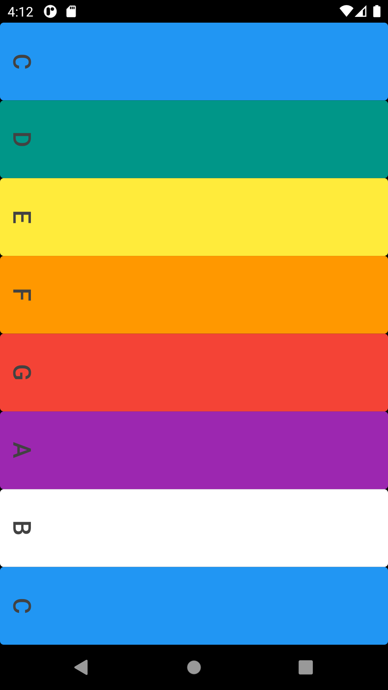

---

6- [Quizzler](quizzler)

A quiz app that tests your general knowledge. The project has been written solely in Dart Language.

Through this project, I've learned:
-   modularising my code into separate classes.
-   dart classes and objects.
-   using class constructors.
-   abstraction, encapsulation, inheritance, polymorphism in Dart Language.
-   extracting Widgets to refactor my code.
-   private and public modifiers in Dart.
-   how to use Dart lists.
-   the difference between var, const and final.

Screenshot of the app:

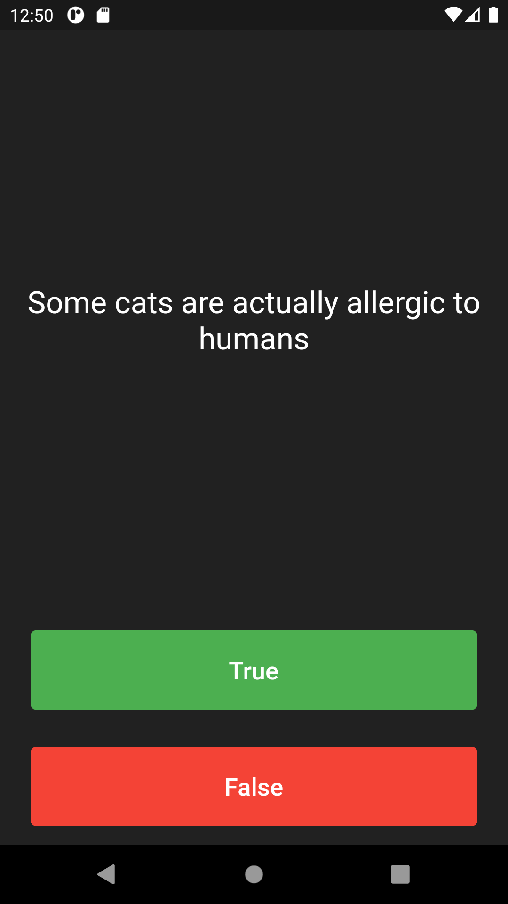

---

7- [Destini](destini)

A game where the story changes according to your decisions. The project has been written solely in Dart Language.

The objective of this project is to solidify what I’ve learned in the Quizzler project.

Screenshot of the app:

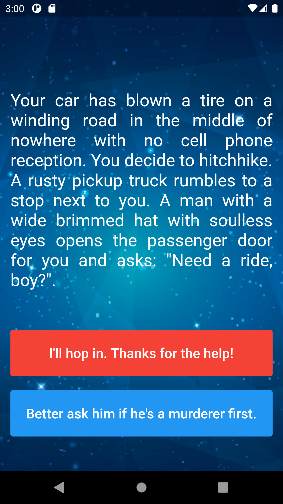

---

8- [BMI Calculator](bmi_calculator)

Body Mass Index Calculator inspired by the beautiful designs made by [Ruben Vaalt](https://dribbble.com/shots/4585382-Simple-BMI-Calculator). The project has been written solely in Dart Language.

Through this project, I've learned:

-   how to use Flutter themes to create coherent branding.
-   how to create multi-page apps using Flutter Routes and Navigator.
-   how to extract and refactor Flutter Widgets with a click of the button.
-   how to pass functions as parameters and fields.
-   how to use the GestureDetector Widget to detect more than just a tap.
-   how to use custom colour palettes by using hex codes.
-   how to customise Flutter Widgets to achieve a specific design style.
-   dart Enums and the Ternary Operator.
-   about composition vs. inheritance and the Flutter way of creating custom UI.
-   the difference between const and final in Dart and when to use each.

Screenshots of the app:

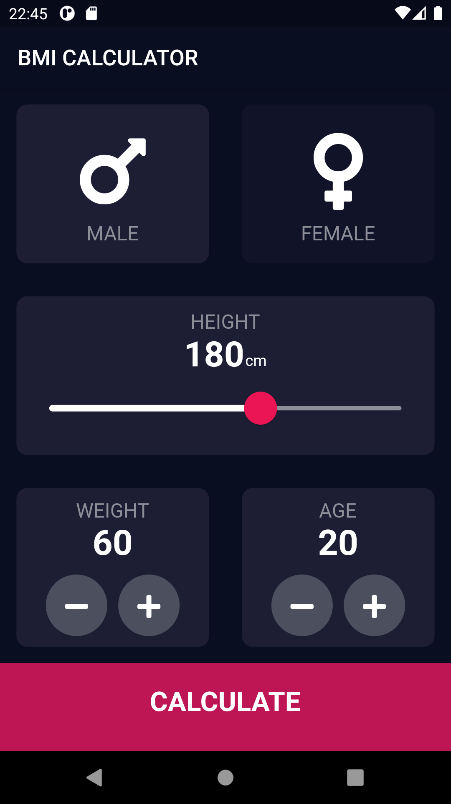&nbsp; &nbsp; &nbsp; &nbsp; &nbsp;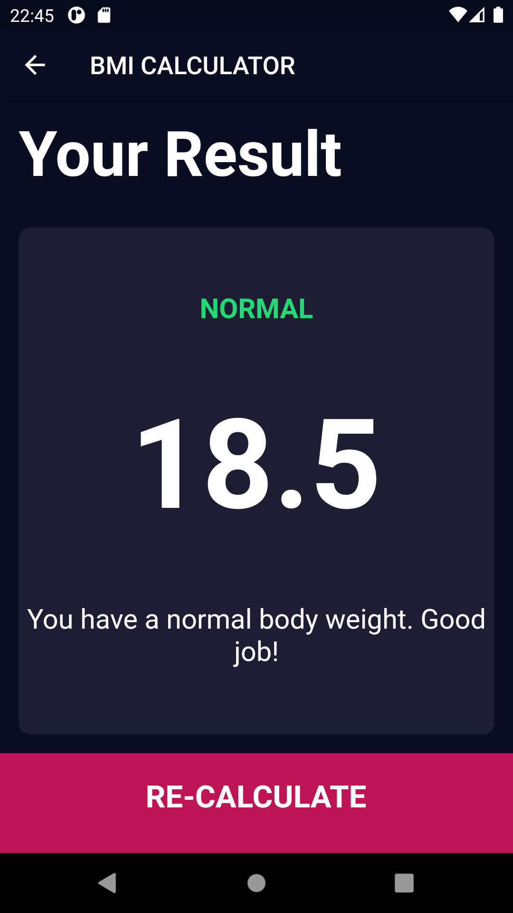

---

9- [Clima](clima)

A weather app inspired by the beautiful designs made by [Olia Gozha](https://dribbble.com/shots/4663154-). The project has been written solely in Dart Language.

Through this project, I've learned:

-   how to use Dart to perform asynchronous tasks.
-   async and await.
-   about Futures and how to work with them.
-   how to network with the Dart http package.
-   what APIs are and how to use them to get data from the internet.
-   what JSONs are and how to parse them using the Dart convert package.
-   how to pass data forwards and backwards between screens using the Navigator.
-   how to handle exceptions in Dart using try/catch/throw.
-   about the lifecycle of Stateful Widgets and how to override them.
-   how to use the Geolocator package to get live location data for both iOS and Android.
-   how to use the TextField Widget to take user input.

Screenshots of the app:

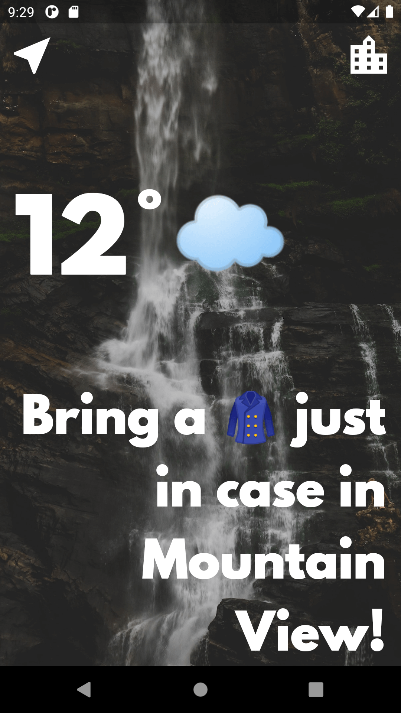&nbsp; &nbsp; &nbsp; &nbsp; &nbsp;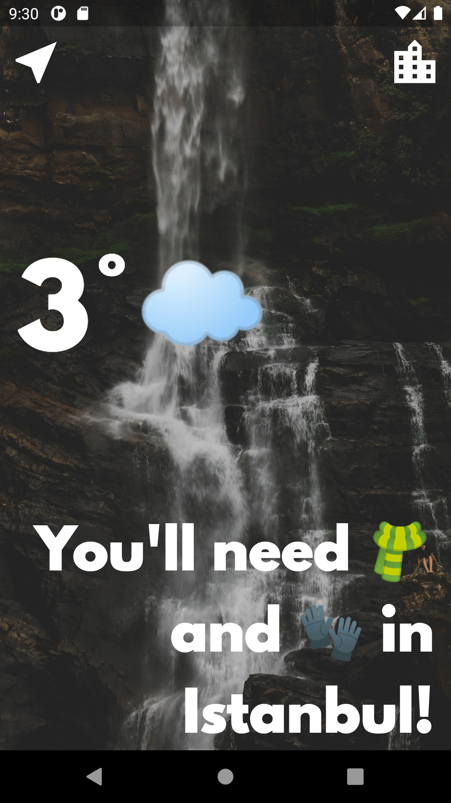&nbsp; &nbsp; &nbsp; &nbsp; &nbsp;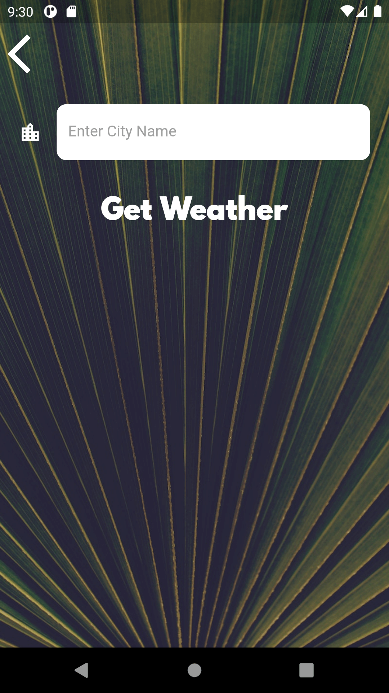

---

10- [Bitcoin Ticker](bitcoin_ticker)

A crypto currency price checking app. The project has been written solely in Dart Language.

Through this project, I've learned how to:

-   use the DropdownButton Widget from Material design.
-   loop through code using Dart for and for-in loops.
-   use Cupertino Widgets in app.
-   check the platform to customise the UI for that platform.

Screenshots of the app:

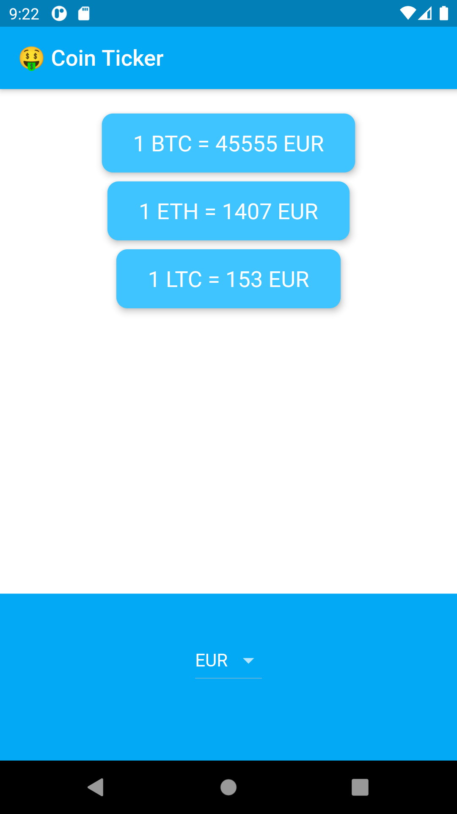&nbsp; &nbsp; &nbsp; &nbsp; &nbsp;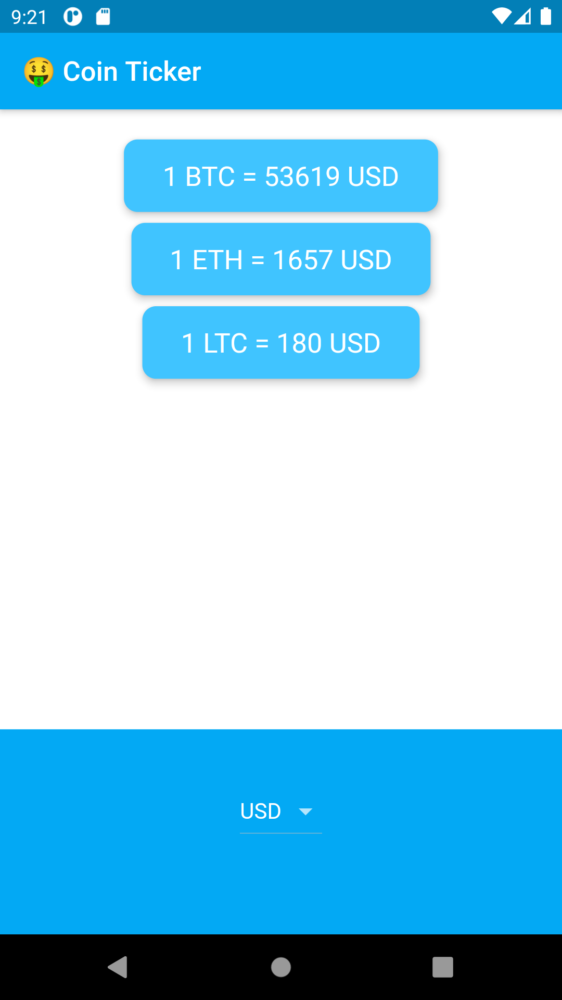

---

11- [Flash Chat](flash_chat)

A modern messaging app where users can sign up and log in to chat. The project has been written solely in Dart Language.

Through this project, I've learned:

-   how to incorporate Firebase into Flutter projects.
-   how to use Firebase authentication to register and sign in users.
-   how to create beautiful animations using the Flutter Hero widget.
-   how to create custom aniamtions using Flutter's animation controller.
-   all about mixins and how they differ from superclasses.
-   about Streams and how they work.
-   to use ListViews to build scrolling views.
-   how to use Firebase Cloud Firestore to store and retrieve data on the fly.

Screenshots of the app:

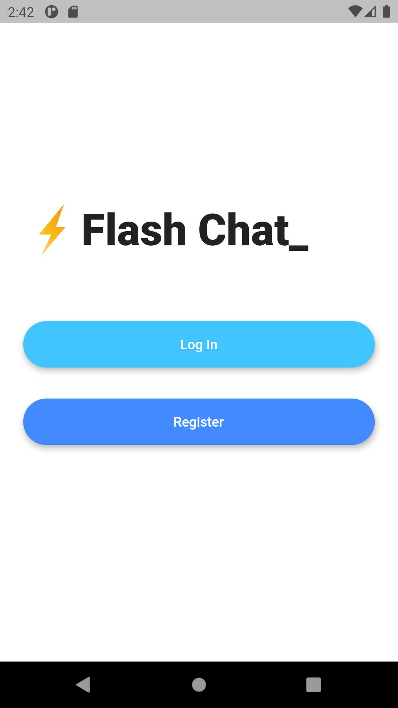&nbsp; &nbsp; &nbsp; &nbsp; &nbsp;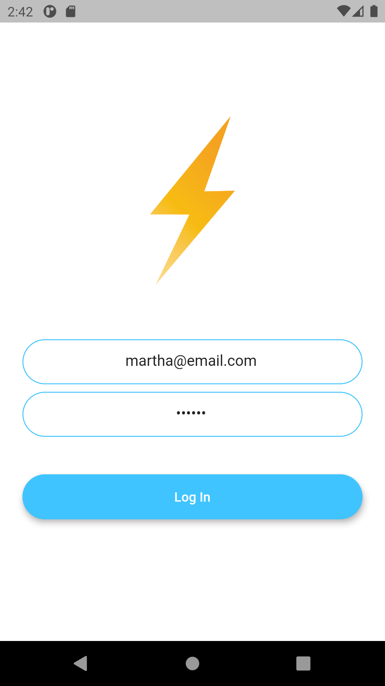

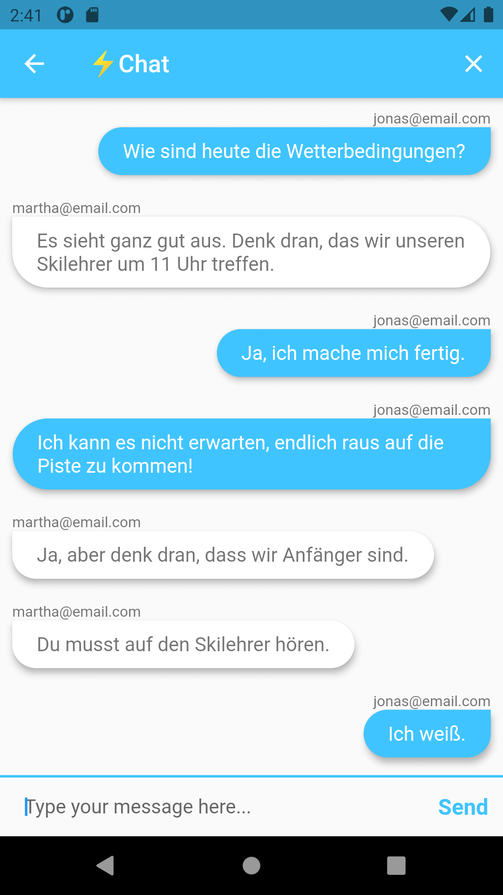&nbsp; &nbsp; &nbsp; &nbsp; &nbsp;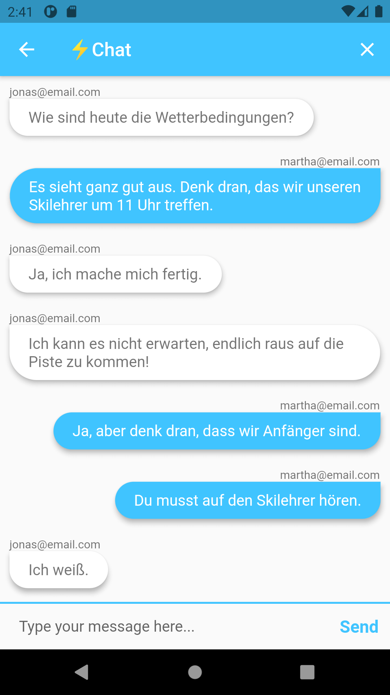

---