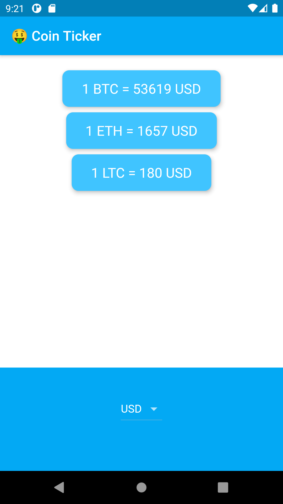

# Bitcoin Ticker

A crypto currency price checking app. The project has been written solely in Dart Language.

## Through this project, I've learned how to:

-   use the DropdownButton Widget from Material design.
-   loop through code using Dart for and for-in loops.
-   use Cupertino Widgets in your app.
-   check the platform your app is being run on to customise the UI for that platform.

Screenshots of the app:

&nbsp; &nbsp; &nbsp; &nbsp; &nbsp;

