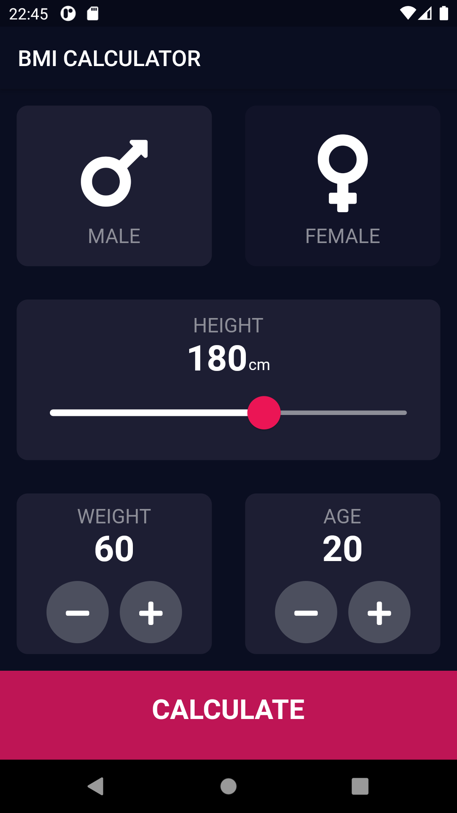
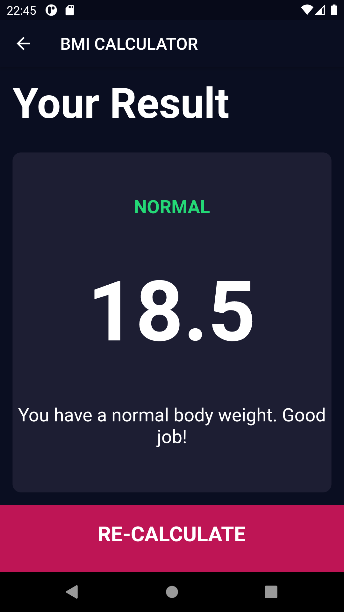

# BMI Calculator

Body Mass Index Calculator inspired by the beautiful designs made by [Ruben Vaalt](https://dribbble.com/shots/4585382-Simple-BMI-Calculator). The project has been written solely in Dart Language.

## Through this project, I've learned:

-   how to use Flutter themes to create coherent branding.
-   how to create multi-page apps using Flutter Routes and Navigator.
-   how to extract and refactor Flutter Widgets with a click of the button.
-   how to pass functions as parameters and fields.
-   how to use the GestureDetector Widget to detect more than just a tap.
-   how to use custom colour palettes by using hex codes.
-   how to customise Flutter Widgets to achieve a specific design style.
-   dart Enums and the Ternary Operator.
-   about composition vs. inheritance and the Flutter way of creating custom UI.
-   the difference between const and final in Dart and when to use each.

Screenshots of the app:

&nbsp; &nbsp; &nbsp; &nbsp; &nbsp;

