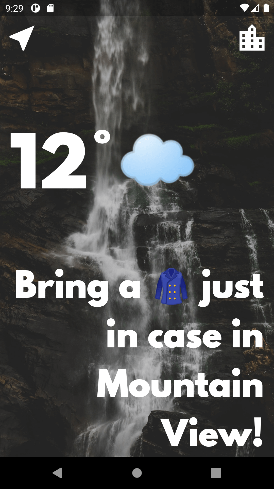
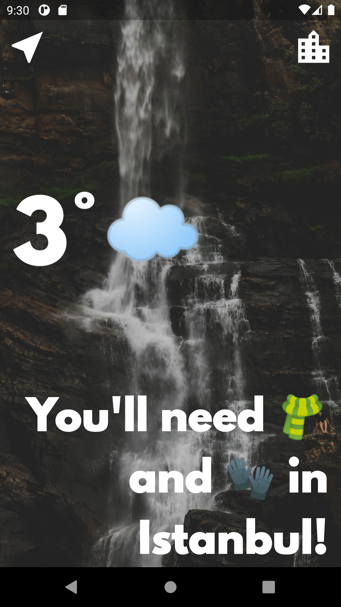
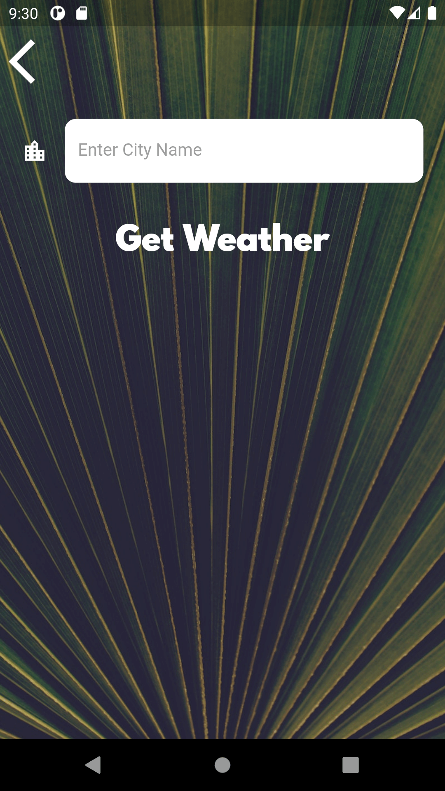

# Clima

A weather app inspired by the beautiful designs made by [Olia Gozha](https://dribbble.com/shots/4663154-). The project has been written solely in Dart Language.

## Through this project, I've learned:

- how to use Dart to perform asynchronous tasks.
- async and await.
- about Futures and how to work with them.
- how to network with the Dart http package.
- what APIs are and how to use them to get data from the internet.
- what JSONs are and how to parse them using the Dart convert package.
- how to pass data forwards and backwards between screens using the Navigator.
- how to handle exceptions in Dart using try/catch/throw.
- about the lifecycle of Stateful Widgets and how to override them.
- how to use the Geolocator package to get live location data for both iOS and Android.
- how to use the TextField Widget to take user input.

Screenshots of the app:

&nbsp; &nbsp; &nbsp; &nbsp; &nbsp;&nbsp; &nbsp; &nbsp; &nbsp; &nbsp;

