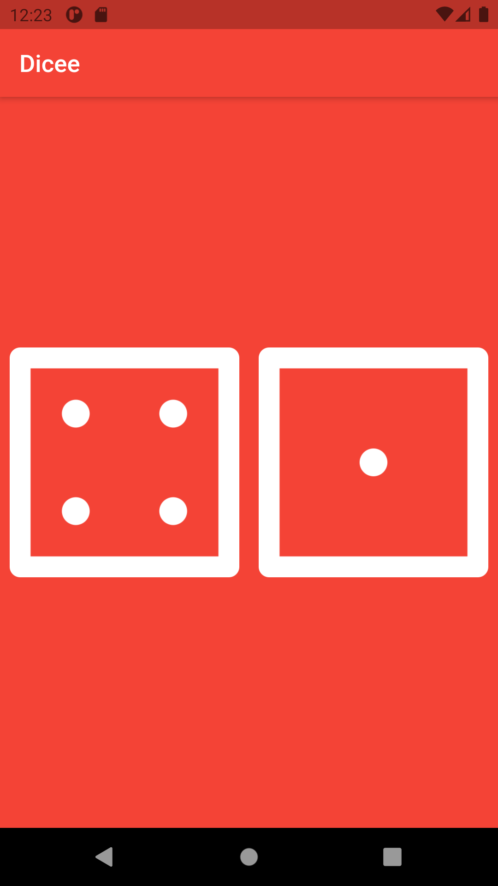

# Dicee

A dice app that can make the die roll at the press of a button. The project has been written solely in Dart Language.

## Through this project, I’ve learned:
-   how to use Flutter stateless widgets to design the user interface.
-	how to use Flutter stateful widgets to update the user interface.
-	how to change the properties of various widgets.
-	how to use onPressed listeners to detect when buttons are pressed.
-	how to use setState to mark the widget tree as dirty and requiring update on the next render.
-	how to use Expanded to make widgets adapt to screen dimensions.
-	string interpolation.
-	basic dart programming concepts such as data types and functions.
-	code and use gesture controls.

Screenshot from the app:

