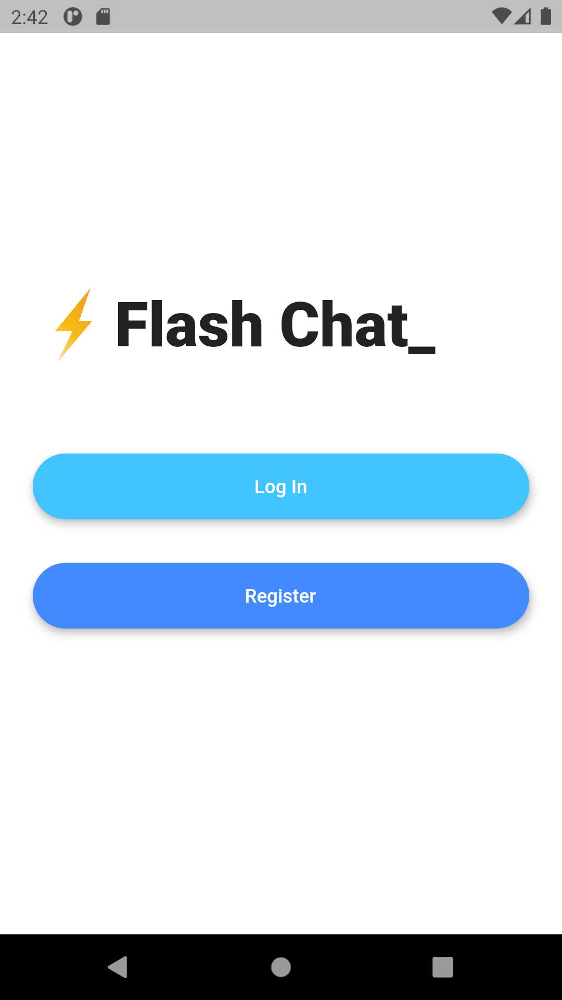
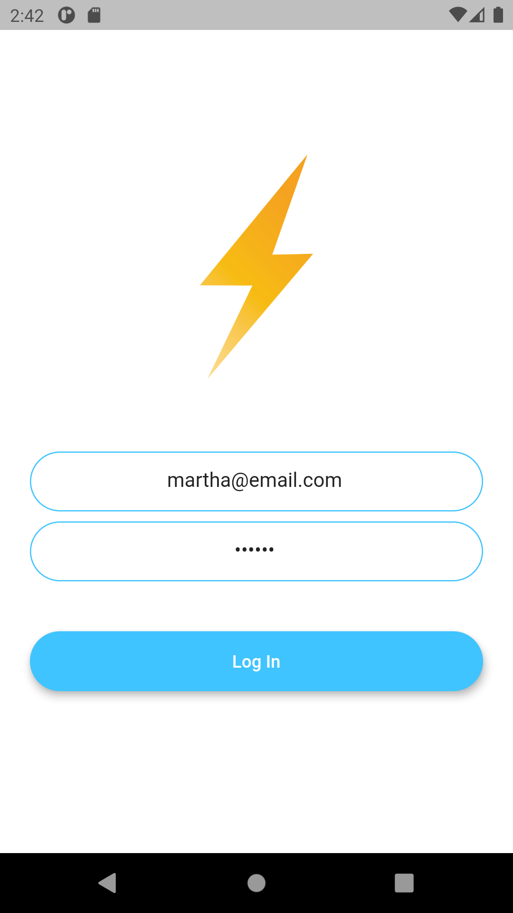
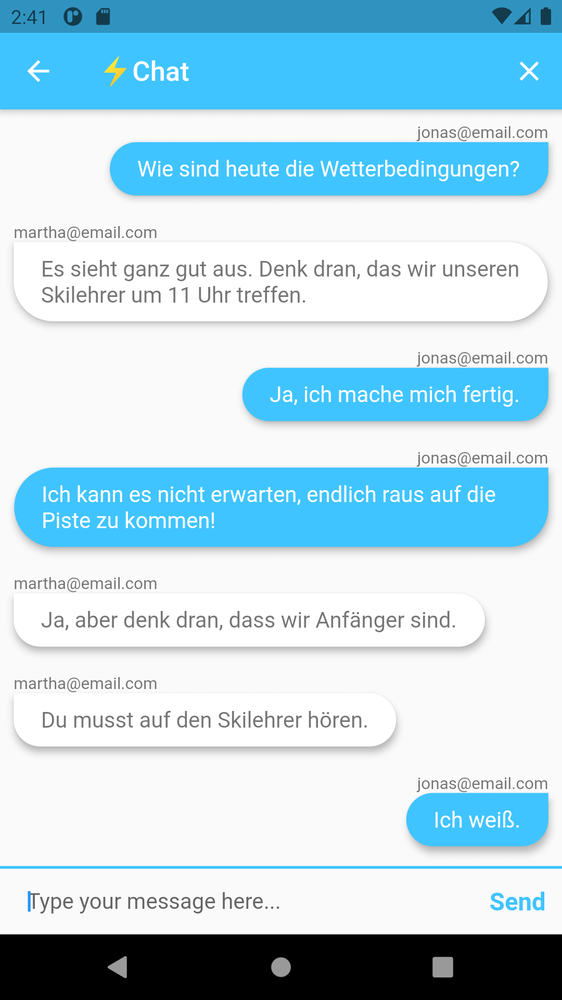
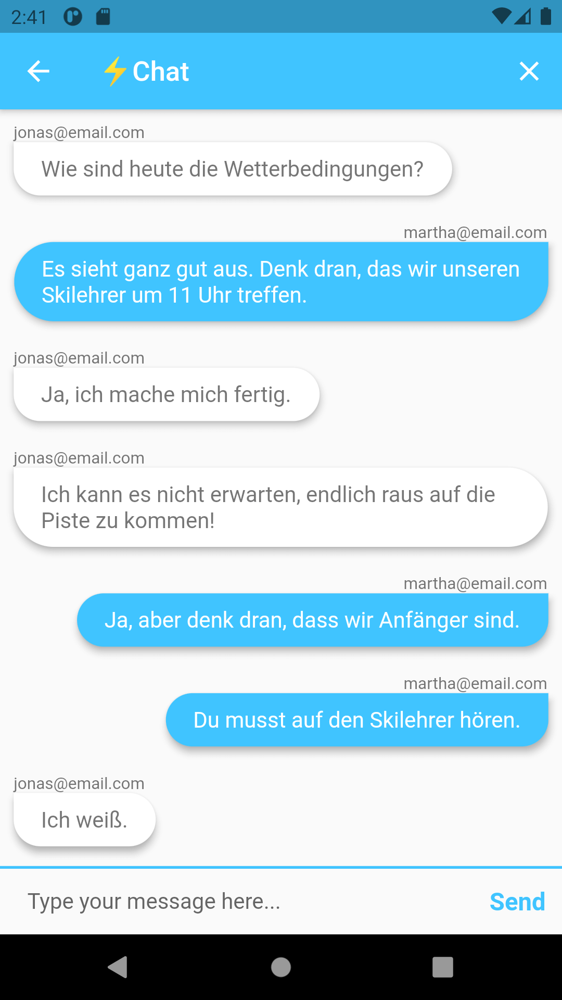

# Flash Chat

A modern messaging app where users can sign up and log in to chat. The project has been written solely in Dart Language.

## Through this project, I've learned:

-   how to incorporate Firebase into Flutter projects.
-   how to use Firebase authentication to register and sign in users.
-   how to create beautiful animations using the Flutter Hero widget.
-   how to create custom aniamtions using Flutter's animation controller.
-   all about mixins and how they differ from superclasses.
-   about Streams and how they work.
-   to use ListViews to build scrolling views.
-   how to use Firebase Cloud Firestore to store and retrieve data on the fly.

Screenshots of the app:

&nbsp; &nbsp; &nbsp; &nbsp; &nbsp;

&nbsp; &nbsp; &nbsp; &nbsp; &nbsp;
