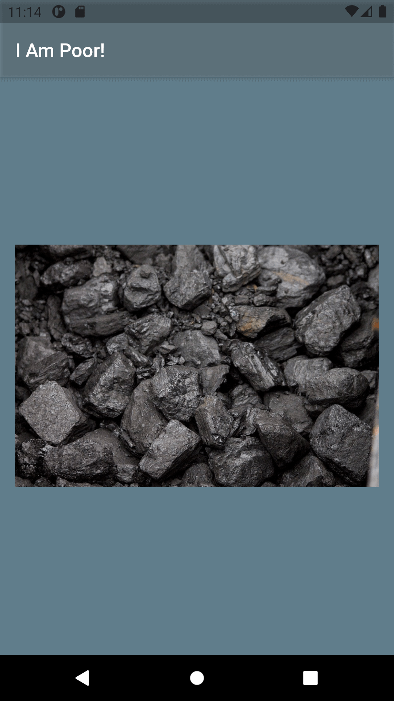

# I Am Poor
An app that simply displays an image at the center of the screen. The project has been written solely in Dart Language.

## Through this project, I've learned how to:
-	set up a new Flutter project using Android Studio.
-	use  pre-made Flutter Widgets for user interface design.
-	incorporate Image and Text Widgets to create simple user interfaces.
-	incorporate App Icons for iOS and Android.
-	add and load image assets to Flutter projects.
-	run Flutter apps on iOS Simulator, Android Emulator, and physical devices.

Screenshot from the app:

