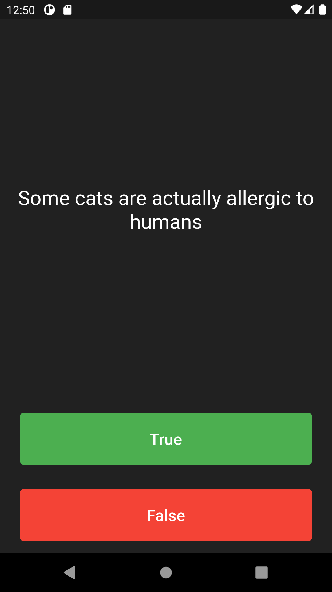

# Quizzler

A quiz app that tests your general knowledge. The project has been written solely in Dart Language.

## Through this project, I've learned:
-   modularising my code into separate classes.
-   dart classes and objects.
-   using class constructors.
-   abstraction, encapsulation, inheritance, polymorphism in Dart Language.
-   extracting Widgets to refactor my code.
-   private and public modifiers in Dart.
-   how to use Dart lists.
-   the difference between var, const and final.

Screenshot of the app:

