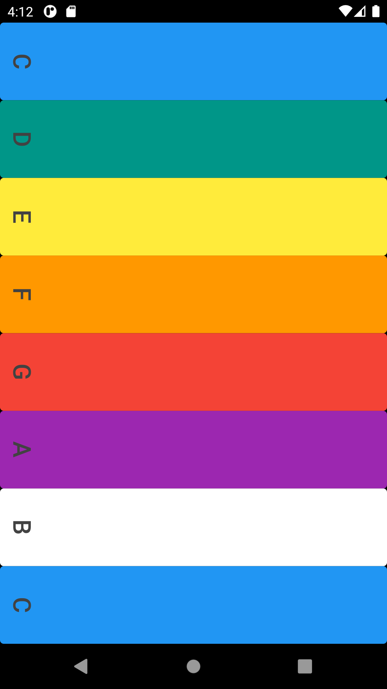

# Xylophone

An app that plays Xylophone sounds.

## Through this project, I’ve learned:
-   how to incorporate open source libraries of code into your project using Flutter Packages.
-   how to play sound on both iOS and Android.
-   how to generate repeated user interface Widgets.
-   how to use Dart functions that can take input arguments as well as return an output.
-   dart arrow syntax for writing one line functions.

Screenshot from the app:

